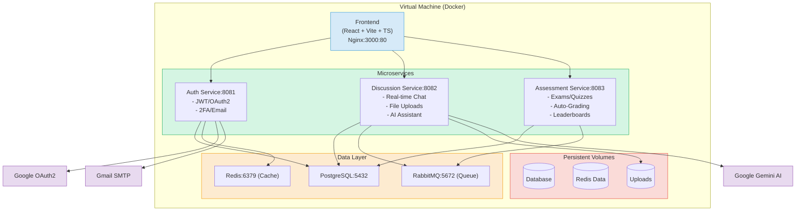

# EduConnect Learning Platform

A comprehensive microservices-based educational platform built with Spring Boot and React, designed for interactive learning, assessments, and community discussions.

## 🏗️ Architecture Overview



## 🚀 Features

### 🔐 Authentication Service
- **Secure Authentication**: JWT-based authentication with refresh tokens
- **Multi-factor Authentication**: Email verification and 2FA support
- **Social Login**: Google OAuth2 integration
- **Password Management**: Forgot/reset password functionality
- **User Management**: Role-based access control (Admin, Teacher, Student)

### 💬 Discussion Service
- **Real-time Messaging**: WebSocket-based chat system
- **Group Discussions**: Create and manage study groups
- **Q&A Forums**: Academic discussion forums
- **File Sharing**: Upload and share educational materials
- **AI Assistant**: Google Gemini AI integration for smart assistance
- **Notifications**: Real-time notification system

### 📚 Assessment Service
- **Exam Management**: Create and manage online exams
- **Practice Questions**: Daily practice questions with scoring
- **Contest System**: Competitive programming-style contests
- **Auto-grading**: Automated answer evaluation
- **Analytics**: Performance tracking and leaderboards
- **Live Exams**: Real-time proctored examinations

### 🎨 Frontend Application
- **Modern UI**: React with TypeScript and Tailwind CSS
- **Responsive Design**: Mobile-first responsive interface
- **Real-time Updates**: WebSocket integration for live features
- **LaTeX Support**: Mathematical equation rendering
- **Component Library**: Radix UI components

## 🛠️ Technology Stack

### Backend
- **Framework**: Spring Boot 3.5.3
- **Language**: Java 17+
- **Build Tool**: Maven
- **Database**: PostgreSQL 15
- **Cache**: Redis 7
- **Message Queue**: RabbitMQ 3.12
- **Security**: Spring Security, JWT
- **API Documentation**: Swagger/OpenAPI

### Frontend
- **Framework**: React 19.1.0
- **Build Tool**: Vite 7.0.4
- **Language**: TypeScript 5.8.3
- **Styling**: Tailwind CSS 4.1.11
- **UI Components**: Radix UI
- **HTTP Client**: Axios
- **Real-time**: Socket.io Client

### Infrastructure
- **Containerization**: Docker & Docker Compose
- **Web Server**: Nginx
- **Deployment**: VM-based deployment
- **Monitoring**: Health checks and logging

### External Services
- **Email**: Gmail SMTP
- **AI**: Google Gemini AI
- **Authentication**: Google OAuth2

## 🚀 Quick Start

### Prerequisites

- **Docker & Docker Compose**: Latest versions
- **Java 17+**: For local development
- **Node.js 18+**: For frontend development
- **Maven 3.8+**: For building Java services

### 1. Clone the Repository

```bash
git clone <repository-url>
cd educonnect-auth-service
```

### 2. Environment Configuration

Create environment configuration file:

```bash
# Copy example environment file
cp .env.example .env

# Edit the .env file with your configuration
nano .env
```

**Required Environment Variables:**

```env
# Database Configuration
DB_USER=educonnect
DB_PASSWORD=your_secure_password
DB_NAME=educonnect

# JWT Configuration
JWT_SECRET=your_super_secret_jwt_key_minimum_32_characters

# Email Configuration (Gmail SMTP)
MAIL_USERNAME=your-email@gmail.com
MAIL_PASSWORD=your-app-password

# Google OAuth2 (Optional)
GOOGLE_CLIENT_ID=your-google-client-id
GOOGLE_CLIENT_SECRET=your-google-client-secret

# Service URLs
FRONTEND_URL=http://localhost:3000
AUTH_URL=http://localhost:8081
ASSESSMENT_URL=http://localhost:8083
DISCUSSION_URL=http://localhost:8082

# Ports
AUTH_SERVICE_PORT=8081
DISCUSSION_SERVICE_PORT=8082
ASSESSMENT_SERVICE_PORT=8083
```

### 3. Running Locally

#### Option A: Full Docker Deployment (Recommended)

```bash
# Start all services with Docker
docker-compose up -d

# View logs
docker-compose logs -f
```

#### Option B: Hybrid Development Setup

```bash
# Start infrastructure only (PostgreSQL, Redis, RabbitMQ)
docker-compose -f docker-compose.infrastructure.yml up -d

# Start backend services locally
cd auth && ./mvnw spring-boot:run &
cd ../discussion-service && ./mvnw spring-boot:run &
cd ../assessment-service && ./mvnw spring-boot:run &

# Start frontend
cd ../frontend
npm install
npm run dev
```

#### Option C: Automated Local Setup

```bash
# Use the provided script (starts infrastructure + local services)
chmod +x run-local.sh
./run-local.sh
```

### 4. Access the Application

- **Frontend**: http://localhost:3000
- **Auth Service**: http://localhost:8081
- **Discussion Service**: http://localhost:8082
- **Assessment Service**: http://localhost:8083
- **RabbitMQ Management**: http://localhost:15672 (guest/guest)

## 📊 Service Endpoints

### Auth Service (Port 8081)
- `POST /api/v1/auth/register` - User registration
- `POST /api/v1/auth/login` - User login
- `POST /api/v1/auth/refresh` - Refresh JWT token
- `GET /api/v1/auth/profile` - Get user profile
- `GET /api/v1/actuator/health` - Health check

### Discussion Service (Port 8082)
- `GET /api/v1/discussions` - Get discussions
- `POST /api/v1/discussions` - Create discussion
- `GET /api/v1/groups` - Get groups
- `POST /api/v1/messages` - Send message
- `GET /api/v1/actuator/health` - Health check

### Assessment Service (Port 8083)
- `GET /api/v1/questions` - Get questions
- `POST /api/v1/submissions` - Submit answer
- `GET /api/v1/contests` - Get contests
- `GET /api/v1/leaderboard` - Get leaderboard
- `GET /api/v1/actuator/health` - Health check

## 🗄️ Database Setup

The application uses PostgreSQL with automatic schema initialization:

```bash
# Database initialization script is automatically run
# Location: ./educonnect-init-db.sql

# For manual database setup:
psql -h localhost -p 5432 -U educonnect -d educonnect -f educonnect-init-db.sql
```

### Demo Data

Load demo data for development:

```bash
# Run demo data scripts
cd demo-data
psql -h localhost -p 5432 -U educonnect -d educonnect -f INSTALL_DEMO_DATA.sql
```

## 🧪 Testing

### Backend Tests

```bash
# Run tests for each service
cd auth && ./mvnw test
cd ../discussion-service && ./mvnw test
cd ../assessment-service && ./mvnw test
```

### Frontend Tests

```bash
cd frontend
npm run test
```

## 📝 API Documentation

- **Auth Service**: http://localhost:8081/swagger-ui.html
- **Discussion Service**: http://localhost:8082/swagger-ui.html
- **Assessment Service**: http://localhost:8083/swagger-ui.html

## 🐳 Production Deployment

### Docker Hub Images

Build and push images:

```bash
# Build all services
docker-compose -f docker-compose.prod.yml build

# Push to Docker Hub (requires authentication)
docker-compose -f docker-compose.prod.yml push
```

### Production Configuration

```bash
# Use production compose file
docker-compose -f docker-compose.prod.yml up -d
```

## 🔍 Monitoring & Logging

### Health Checks

All services include health check endpoints:
- Individual service health: `/actuator/health`
- Docker health checks configured with retries

### Logging

```bash
# View service logs
docker-compose logs -f [service-name]

# View specific service logs
docker-compose logs -f auth-service
docker-compose logs -f discussion-service
docker-compose logs -f assessment-service
```

### Log Files (Local Development)

```
logs/
├── auth.log
├── discussion.log
├── assessment.log
└── frontend.log
```

## 🛠️ Development

### Code Structure

```
├── auth/                     # Authentication Service
├── assessment-service/       # Assessment Service  
├── discussion-service/       # Discussion Service
├── frontend/                 # React Frontend
├── demo-data/               # Sample data scripts
├── api-docs/                # API documentation
├── docker-compose.yml       # Development compose
├── docker-compose.prod.yml  # Production compose
└── run-local.sh            # Local development script
```

### Contributing

1. Fork the repository
2. Create feature branch: `git checkout -b feature/amazing-feature`
3. Commit changes: `git commit -m 'Add amazing feature'`
4. Push to branch: `git push origin feature/amazing-feature`
5. Open Pull Request

## 🚨 Troubleshooting

### Common Issues

**Port Already in Use:**
```bash
# Check what's using the port
lsof -i :8081

# Kill process on port
kill -9 $(lsof -t -i:8081)
```

**Database Connection Issues:**
```bash
# Check PostgreSQL container
docker-compose logs postgres

# Reset database
docker-compose down -v
docker-compose up -d
```

**Service Dependencies:**
```bash
# Check service startup order
docker-compose ps

# Restart specific service
docker-compose restart auth-service
```

## 📄 License

This project is licensed under the MIT License - see the [LICENSE](LICENSE) file for details.

## 👥 Contributors

- Development Team
- Educational Technology Specialists
- UI/UX Designers

## 📞 Support

For support and questions:
- Create an issue in the repository
- Contact the development team
- Check the documentation

---

**Happy Learning with EduConnect! 🎓**